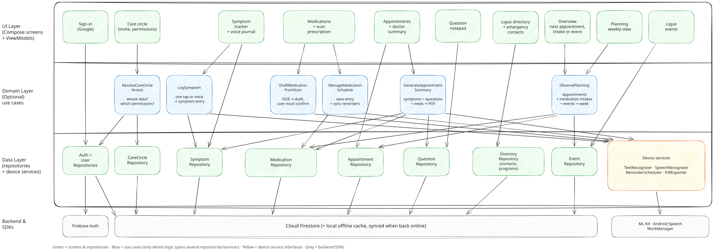

# Architecture

Oncompanion follows MVVM with three layers. Arrows point from the caller to what it depends on: the UI calls the domain layer (or the data layer directly when there is no logic to share), and nothing below ever calls up.



Green = screens and repositories, blue = use cases, yellow = device service interfaces (wrapping ML Kit and Android APIs), grey = backend and SDKs, red dashed = P2 stretch goals.

To edit the diagram, open [`architecture.excalidraw`](architecture.excalidraw) on [excalidraw.com](https://excalidraw.com) (Menu → Open), make your changes, then save it back to the same file and export it with *Export image → SVG* (keep "Embed scene" off) to overwrite `architecture.svg`. Commit both files in the same PR as the code change.

## Layers

**UI layer** (`ui/<feature>/`). Each screen is a stateless composable plus a ViewModel that exposes a `StateFlow<UiState>`. ViewModels take their repositories and use cases in the constructor, so tests pass fakes. No Firebase or Android `Context` here. Overview, Planning and Events are the bottom-bar tabs. Overview shows what comes next (the next appointment, medication intake or Ligue event) by taking the first upcoming item from `ObservePlanning`. It is read-only: symptoms are logged from the symptom tracker, not from Overview.

**Domain layer** (`domain/<feature>/`, optional). One class per use case with a single `operator fun invoke(...)`. Only add one when the logic combines several repositories or device services, or is worth unit-testing on its own. Plain reads and writes (questions, directory, events, appointments list) go straight from the ViewModel to the repository.

- `LogSymptom` turns a one-tap entry or a voice transcript into a symptom entry for the right patient, so one-tap entries and the voice journal in the symptom tracker share the same logic.
- `ManageMedicationSchedule` saves a confirmed prescription with its medications and keeps their reminders in sync. All medication writes go through it, so reminders never drift from the stored schedule.
- `DraftMedicationFromScan` returns a *draft* with low-confidence fields flagged. Nothing is saved until the patient confirms it on the review screen.
- `GenerateAppointmentSummary` gathers the symptoms, open questions and medications for an upcoming appointment into a summary the patient can show on screen or export as a PDF (through `PdfExporter`). The patient chooses what goes in it, and it only reports what they logged.
- `ObservePlanning` is the planned integration that will merge appointments, medications and Ligue events for Planning. The current `PlanningRepository` is a read contract with an empty runtime implementation; live aggregation is not implemented yet. Planning has no store of its own: each `PlanningSource` references the feature that owns the data and handles editing.
  - `PlanningTiming.Timed` holds an instant for an appointment or event. `DateOnly` holds a calendar date for an active medication; it is not a scheduled intake, and its day does not shift with the display zone. Medication frequency is recorded free text and is never interpreted into times or doses.
  - `PlanningRange` specifies inclusive/exclusive calendar dates and a display zone, with derived instant boundaries for timed queries. Future adapters emit only occurrences in that range. Medication expansion must be bounded to it, using `startDate` and `durationDays`; a row describes the recorded active period, not a claim that a dose is due on that day. Non-daily free-text frequency remains visible without interpreting it.
  - The selected-day agenda shows date-only medications first under “No set time”, then appointments/events under “Scheduled” in time order. Keys include source IDs and occurrence date/time, independent of editable text. Frequency is separate from appointment/event subtitle text.
  - Future aggregation reads `MedicationRepository.observeMedications(uid)`, never Firestore directly. It must cancel/clear patient-specific observations on account changes and use local-cache flows. Events need a defined source time zone and a range-capable repository for past-week browsing; the current upcoming-only event contract does not provide history. Overview's current time-required model must also support date-only entries before sharing this data. No fake medication time or taken/overdue status is introduced.
  - Repositories are injected through the existing screen/ViewModel boundary. Tests and previews supply mixed entries; production still supplies an empty source. No new collection, layer or dependency is introduced by the mixed-entry contract.
- `ResolveCareCircleAccess` decides whose data the current user is looking at (their own, or a patient who shared with them) and what they are allowed to see. Every screen that shows patient data asks it for the target `uid`, so caregiver mode is not a separate code path.

**Data layer** (`model/<feature>/`). Data classes, a repository interface, and its Firestore implementation (`SymptomRepository` / `SymptomRepositoryFirestore`). Ligue events have their own `EventRepository`, separate from the directory of contacts and programs. Device services (`TextRecognizer`, `SpeechRecognizer`, `ReminderScheduler`, `PdfExporter`) follow the same interface + implementation pattern, so domain code never touches ML Kit or Android APIs directly.

## Offline mode

Firestore's local cache is the offline store: writes are applied locally right away and synced when the connection returns, and repositories expose `Flow`s from snapshot listeners so the UI updates either way. No separate Room database is needed. Text recognition, reminders and on-device speech work without a network.

## Firestore layout

```
/users/{uid}                          profile (owner only)
/users/{uid}/symptoms/{id}
/users/{uid}/prescriptions/{id}       doctor, date and the list of its medications
/users/{uid}/appointments/{id}
/users/{uid}/questions/{id}
/users/{uid}/circle/{memberUid}       permissions granted to a care-circle member
/invites/{code}                       pending care-circle invites
/directory/{contacts|programs|events}/items/{id}   read: signed in, write: staff
```

Care-circle members read a patient's data through rules that check `/users/{uid}/circle/{request.auth.uid}`. Staff status comes from a custom claim set by the team, never from a field users can write.

A prescription is one document: the prescribing doctor and the date, stored once, and the list of its medications, each with its own ID, start date and duration. A prescription and its medications are always written together (one form, one use case), so keeping them in one document makes saving, replacing or deleting a prescription a single write. It can't be half saved, and its medications can't be partly known by a device that is offline, mixed when two devices edit at once, or left behind after a deletion. Planning, reminders and the appointment summary still work on single medications: the repository reads them out of the prescriptions, so they never deal with a prescription. Anything recorded per intake later (e.g. a medication marked as taken) would go in its own collection, not in the prescription.
